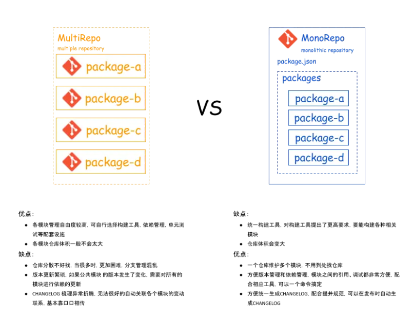
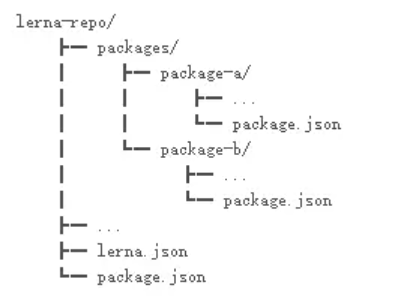

# Lena

Lerna 是一个管理多个 npm 模块的工具，是 MonoRepo 模式，把所有相关的 package 都放在一个仓库里进行管理，每个 package 独立发布



一个基本的 Lerna 管理的仓库结构如下：



# 使用

```
npm i -g lerna
```

`lerna init` 自动生成 packages 目录，lerna.json 和 package.json

`lerna create <package-name> [loc]` 在 loc 位置，创建一个 package，注意 loc 必须在

```JSON
{
  "workspaces": [
    "packages/*",
    "packages/@yl/*",
  ]
}
```

例子 `lerna create @ylbupt/p5-project packages/@ylbupt`

添加依赖

- `lerna add <dep-name>` 为所有 `packages/*` 添加依赖
- `--scope` 只为具体 package 添加依赖
- `--dev` `--peer`

`lerna list` 列举所有 packages
`lerna clean` 删除 所有 packages 的 node_modules

# 运行测试或者命令

`lerna run --scope <package-name> <script> [...args]`

`lerna exec --scope <package-name> -- <command> [...args]`

# 发布

## npm 单个包原始发布

`npm version patch & npm publish`

注意 `@<ori-name>/<pack-name>` 一定要在仓库中新建组织

## lerna 发布

git 设置 `git remote add origin git@gitlab.yourSite.com:gaopo/lerna-gp.git`
npm 设置 `npm adduser & npm login & npm config set registry https://registry.npmjs.org/`

- `lerna changed`
  需要先 git add，git commit 提交。
  然后内部会运行 git diff --name-only v 版本号 ，搜集改动的包，就是下次要发布的。并不是网上人说的所有包都是同一个版全发布
- `lerna publish`
  会打 tag，上传 git，上传 npm，可以选择版本号

发布有两种发布模式 fixed/independent，需要修改 lerna.json 中的 version

```json
// lerna.json
{
  "version": "0.0.0", // fixed 所有包的版本和 lerna 同步变换
  "version": "independent" // independent，只发布改变了的 package
}
```

# 切换 包管理工具

`npm cache clean --force` 设置 "npmClient": "yarn"

# 其他

其实 `pnpm` 和 `yarn` 都可以管理 多个包
