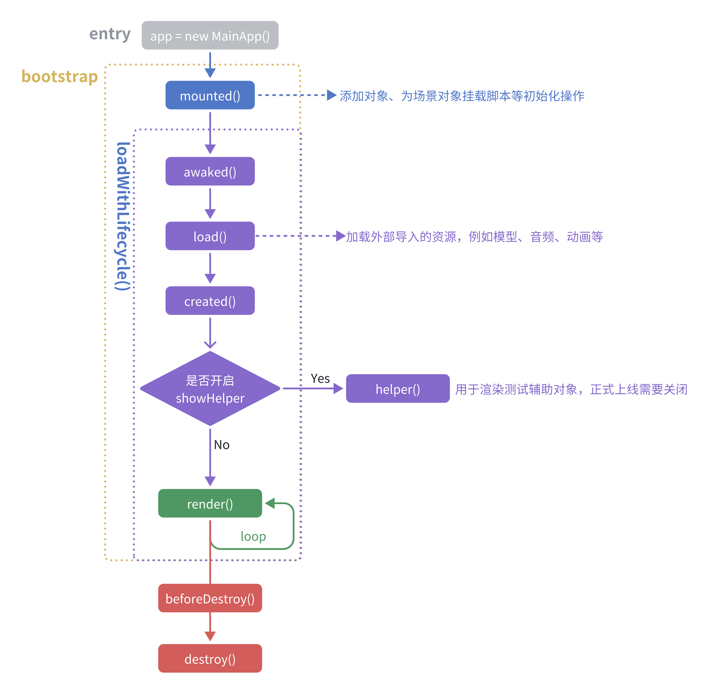

# 介绍

这是一个模块化开发 3D 应用的库，基于 `threejs` 的高级封装，以面向对象的方式，快速高效地编写你的应用。同时开发流程和 `Unity` 等引擎十分吻合，使得这部分开发者可以非常方便地构建自己的 3D 网页应用

# 安装

```bash
npm i @ylbupt/three-game-engine
```

<a href="https://yanglebupt.github.io/npm-repo/#/APIs/MainApp">文档</a>，<a href="https://github.com/yanglebupt/npm-repo/tree/dev/packages/%40ylbupt/three-game-engine/start-demo">快速开始</a>

# 主要特性

- 支持较为完善的生命周期



- 支持导入外部 3D 对象，并支持挂载自定义脚本`Script`来控制 3D 对象

```typescript
import { ObjectScript } from '@ylbupt/three-game-engine'

/* options 类型 */
export interface RotateScriptOptions {
  speed: number
}

export class RotateScript extends ObjectScript<RotateScriptOptions> {
  render(time: number, dt: number) {
    this.object.rotateY(dt * this.options.speed)  /* 通过 this.options 访问传入的参数 */
  }
}

```

- 统一的管理器，包括音频`SoundManager`、场景`SceneManager`、加载`LoaderBar`、事件监听`Input`