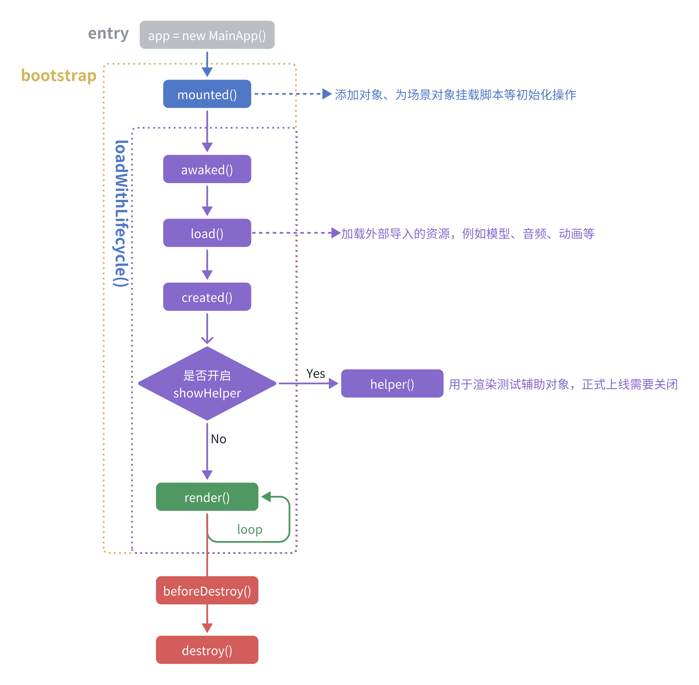

# MainApp

整个 3D 应用的入口，开发的应用必须继承 `MainApp` 类

## Constructor

构造方法可接受的参数类型为 `MainAppOptions` 对象，其包含的属性如下

| 属性 | 描述 | 类型 |	默认值 |
|:--------|:---------:|:---------:|--------:|
| `backgroundColor` | 背景颜色 | `ColorRepresentation` | `0xcccccc` |
| `showEnvMap` | 是否开启展示天空的环境贴图 | `boolean` | `false` |
| `useEnvMap` | 天空的环境贴图是否作用于场景 | `boolean` | `false` |
| `envMapPath` | 环境贴图路径 | `string` | `''` |
| `envMapType` | 环境贴图是 cube 类型，还是 hdr 类型 | `EnvMapType` | `EnvMapHDR` |
| `orbitControl` | 是否启用控制器 | `boolean` | `false` |
| `loadWhenConstruct` | 是否在父构造函数中调用 `loadWithLifecycle()` 方法 | `boolean` | `true` |
| `showHelper` | 是否调用脚本的 `helper()` 生命周期函数 | `boolean` | `false` |

## Attributes 

实例属性如下

| 属性 | 描述 | 类型 |	默认值 |
|:--------|:---------:|:---------:|--------:|
| `options` | 构造函数的参数 | `MainAppOptions` ||
| `scene` | 场景对象 | `Scene` ||
| `mainCamera` | 场景主相机 | `PerspectiveCamera` ||
| `renderer` | 渲染器，默认使用 `renderer` 进行渲染 | `WebGLRenderer` ||
| `composer` | 渲染组合器，一旦创建，则会使用该 `composer` 进行渲染 | `EffectComposer` | `null` |
| `orbitControl` | 控制器，由 `options.orbitControl` 控制是否创建 | `OrbitControls` | `null` |
| `clock` | 全局时钟 | `Clock` ||
| `dt` | 每帧间隔时间 (s) | `number` ||
| `t` | 运行总时间 (s) | `number` ||
| `mixers` | 动画混合器，会在 `render()` 的每一帧中进行更新 | `AnimationMixer[]` | `[]` |
| `loadingManager` | 加载管理器 | `LoadingManager` ||
| `container` | 挂在 DOM 的 `div` 容器 | `HTMLDivElement` ||
| `lookAt` | 相机注视点 | `Vector3: setter getter` ||

## Methods

#### createRenderer()

```typescript
function createRenderer(
  _renderer?: WebGLRenderer
) => WebGLRenderer
```

使用传入的 `_renderer` 或者创建一个新的 `WebGL` 渲染器，设置好对应属性然后返回

#### disposeRenderer()

释放当前 App 的 renderer，调用完该方法后 `this.renderer = null`，并且页面也不在渲染内容

#### updateRenderer()

```typescript
function updateRenderer(
  _renderer: WebGLRenderer
) => void
```

#### render()

每帧调用的渲染函数，当继承自 `MainApp` 的类想要重写该方法时，必须先调用 `super.render()`

```typescript
export class App extends MainApp {
  render(){
    super.render();
    // code
  }
}
```

#### loadWithLifecycle()

加载资源并调用脚本的生命周期函数，脚本的生命周期流程如下图所示


该方法默认在父构造函数中调用

<mark>TODO</mark>：后续挂载脚本将全部转移到构造函数中，这样脚本的每个生命周期函数都都可以执行到

#### awaked()

执行所有脚本的 `awaked()` 生命周期钩子 

#### load()

加载资源

#### created()

执行所有脚本的 `created()` 生命周期钩子 

#### beforeRender()

执行所有脚本的 `beforeRender()` 生命周期钩子 

#### helper()

执行所有脚本的 `helper()` 生命周期钩子 

#### destroy()

销毁当前场景和应用